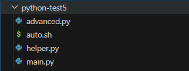
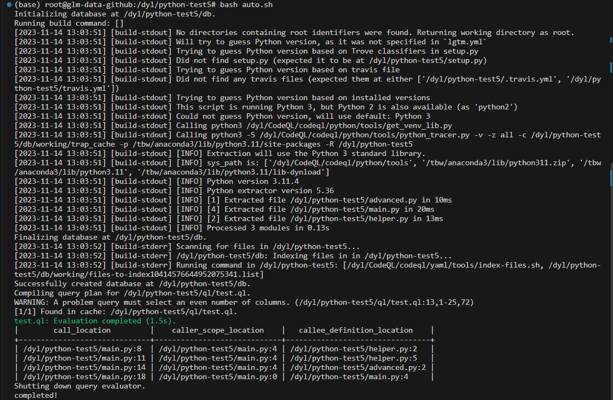
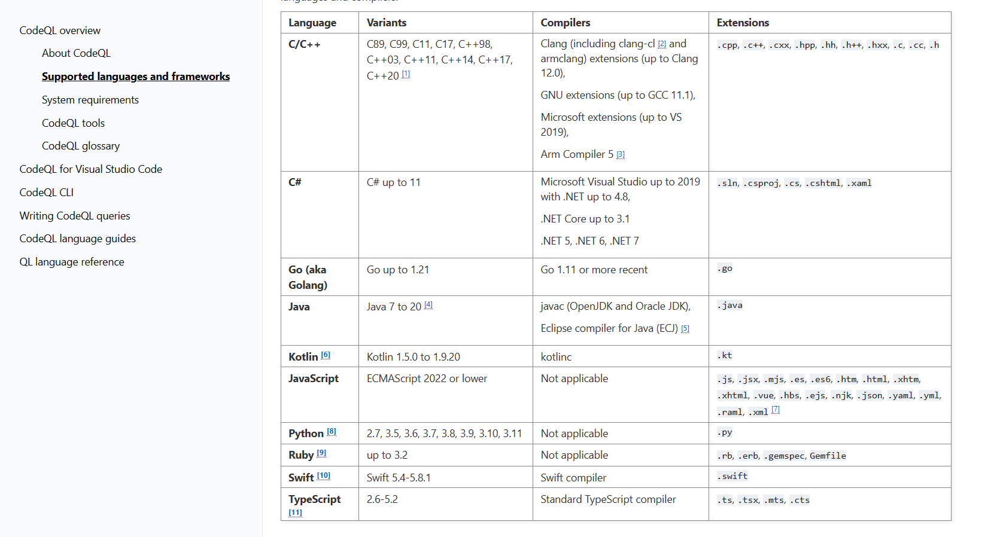
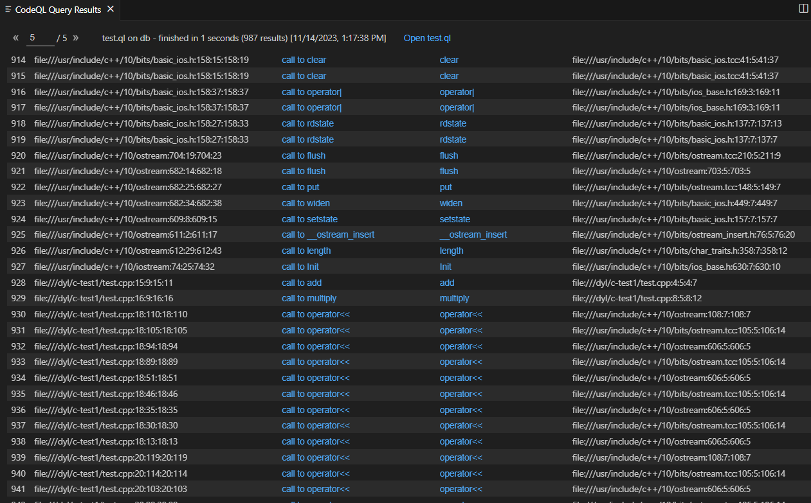
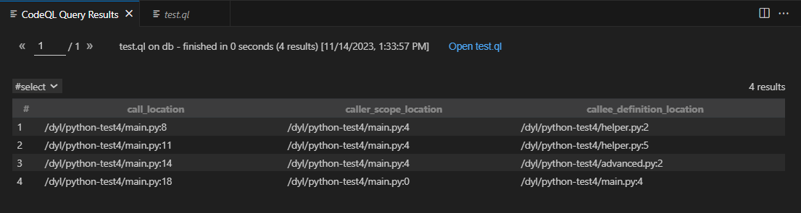
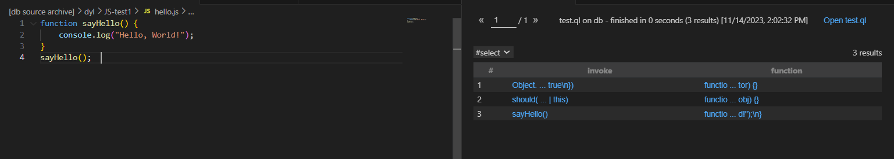
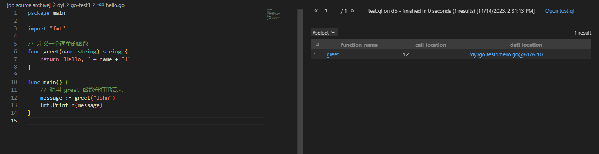
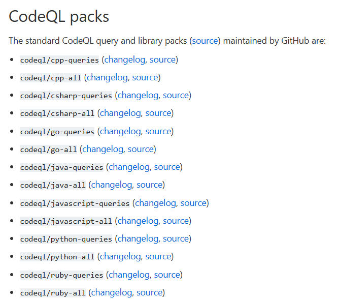

# Links to Resources

CodeQL Official Documentation 		
  1.0 Overview

  [CodeQL overview — CodeQL (github.com)](https://codeql.github.com/docs/codeql-overview/)

  1.1 CLI

  CodeQL CLI Installation [Setting up the CodeQL CLI - GitHub Docs](https://docs.github.com/en/code-security/codeql-cli/getting-started-with-the-codeql-cli/setting-up-the-codeql-cli)

  Creating a Database [Preparing your code for CodeQL analysis - GitHub Docs](https://docs.github.com/en/code-security/codeql-cli/getting-started-with-the-codeql-cli/preparing-your-code-for-codeql-analysis)

  Query Analysis [Analyzing your code with CodeQL queries - GitHub Docs](https://docs.github.com/en/code-security/codeql-cli/getting-started-with-the-codeql-cli/analyzing-your-code-with-codeql-queries)

  1.2 Query Language

  Guide [CodeQL language guides — CodeQL (github.com)](https://codeql.github.com/docs/codeql-language-guides/)

  Libraries [CodeQL standard libraries (github.com)](https://codeql.github.com/codeql-standard-libraries/)

  1.3 Code Examples

  Go repository [codeql/go/ql/examples/snippets at main · github/codeql](https://github.com/github/codeql/tree/main/go/ql/examples/snippets)

  Other language examples are also available.

# Example(Python)

```bash
# auto.sh
# Under the root directory of the project

# Create a CodeQL database
codeql database create db --language=python

# Create a ql directory
mkdir ql

# Create a qlpack.yml file in the ql folder
echo "name: qianlihuang/myquery
version: 0.0.0
dependencies: 
    codeql/python-all: \"*\"
    codeql/python-queries: \"*\"" > ql/qlpack.yml

# Create a query file in the ql directory
echo "
/**
 * Query metadata
 *
 * @id python/test
 * @kind problem
 * @severity error
 */


import python

from
  Value val, CallNode call, string call_location, string caller_scope_location,
  string callee_definition_location
where
  call = val.getACall() and
  (
    callee_definition_location = val.(CallableValue).getScope().getLocation().toString()
    or
    callee_definition_location = val.(ClassValue).getScope().getLocation().toString()
  ) and
  caller_scope_location = call.getScope().getLocation().toString() and
  call_location = call.getLocation().toString()
select call_location, caller_scope_location, callee_definition_location" > ql/test.ql


# codeql database analyze db /ql/test.ql --format=csv --output=results/results.csv

codeql query run ql/test.ql -d db


echo "completed!
```





# Tested CodeQL Queries



may need to be improved

## CPP

```
import cpp

from
  FunctionCall call, Function function, string call_location, //, string caller_scope_location
  string callee_definition_location
where
  call.getTarget() = function and
  // (
  //   function.hasName("add") or
  //   function.hasName("multiply")
  // ) and
  //function.getLocation().getFilePath().startsWith("file:///dyl/c-test1/")
  //caller_scope_location = call.getParentScope().getLocation().toString() and
  callee_definition_location = function.getLocation().toString() and
  call_location = call.getLocation().toString() //and
select call_location, call, function as function_name, callee_definition_location
```



## Python

```
/**
 * Query metadata
 *
 * @id python/test
 * @kind problem
 * @severity error
 */


import python

from
  Value val, CallNode call, string call_location, string caller_scope_location,
  string callee_definition_location
where
  call = val.getACall() and
  (
    callee_definition_location = val.(CallableValue).getScope().getLocation().toString()
    or
    callee_definition_location = val.(ClassValue).getScope().getLocation().toString()
  ) and
  caller_scope_location = call.getScope().getLocation().toString() and
  call_location = call.getLocation().toString()
select call_location, caller_scope_location, callee_definition_location"
```



## JavaScript

```
import javascript
import semmle.javascript.explore.CallGraph
import DataFlow

from InvokeNode invoke, FunctionNode function //, string invoke_location
where
  callEdge*(invoke, function) and
  isStartOfCallPath(invoke) //and
//invoke_location = invoke.getLocation().toString()
select invoke, function //, invoke_location
```



## Golang

```
import go

from Function function, string call_location, Location defi_location
where
  call_location = function.getACall().getStartLine().toString() and
  defi_location = function.getDeclaration().getLocation()
select function as function_name, call_location, defi_location
```



# Note

qlpack.yml dependencies list



# Issue

difference between query run and analyze

what is a query metadata

# Tips

using VSCode extension to develop CodeQL queries

